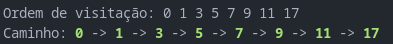
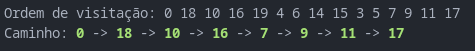
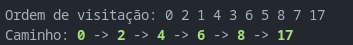

## Relatório
---
### 1. DFS original vs. DFS ponderado

#### DFS original

**Como funciona**: empilha todos os vizinhos na ordem em que aparecem na lista de adjacência e, a cada passo, desempilha o próximo vértice.

**Consequência**: a escolha de qual vizinho entrar “ao fundo” primeiro depende apenas da ordem de inserção das arestas no grafo, sem nenhuma relação com o peso.

**Saída típica (sem peso)**:

 

---
#### DFS ponderado

**Abordagem**: ao expandir um vértice u, fazemos três passagens sobre os seus vizinhos:

empilha primeiro todas as arestas de peso 3 (satélite);

em seguida, empilha as de peso 2 (5G);

por fim, empilha as de peso 1 (fibra).

**Por que funciona**: a pilha é LIFO (último a entrar, primeiro a sair). Logo, mesmo empilhando primeiro os piores enlaces (peso 3), eles acabam no “fundo” da pilha, e os enlaces de fibra (peso 1) empilhados por último  são desempilhados primeiro.

**Impacto no percurso**: mantemos a característica de “mergulhar em profundidade” de cada ramo, mas sempre preferindo fibras antes de pular para 5G ou satélite.

**Saída obtida**:

 

### 2. BFS original vs. BFS ponderado
#### BFS original

**Como funciona**: usa uma fila única. Visita primeiro todos os vértices a 1 salto de distância, depois todos a 2 saltos, e assim por diante.

**Consequência**: garante o menor número de hops, mas pode usar enlaces de satélite ou 5G, mesmo havendo rotas por fibra.

**Saída típica (sem peso)**:

---

#### BFS ponderado

**Abordagem**: em vez de uma fila única, mantemos três filas paralelas, uma para cada peso (1, 2 e 3).

Enfileiramos o nó inicial na fila de fibra.

A cada passo, para decidir quem visitar, checamos as filas nessa ordem:

se a fila da fibra não estiver vazia, retiramos dela;

senão, retiramos da fila do 5G;

senão, da fila do satélite.

Quando visitamos um nó, seus vizinhos não visitados são enfileirados na fila correspondente ao peso do enlace.

**Por que funciona**: enquanto houver vizinhos por fibra, a BFS ponderada nunca recorre ao 5G ou ao satélite  só esgota a fila de peso 1 e aí passa à de peso 2, e depois à de peso 3.

**Impacto no percurso**: preserva a camadação por número de saltos, mas dentro de cada “nível” privilegia totalmente as fibras. No nosso grafo, há um caminho 100 % fibra de 0 a 17, então ele encontrou exatamente essa rota.

**Saída obtida**:

---

### 3. Como os pesos influenciam
Sem ponderação, tanto DFS quanto BFS ignoram o peso: a exploração segue a ordem pura das listas de adjacência (DFS) ou a sequência de camadas por número de hops (BFS).
Com ponderação, em cada expansão:
o algoritmo identifica a tecnologia de cada enlace (peso 1, 2 ou 3);
prioriza integralmente as arestas de peso 1 (fibra), só considerando 2 (5G) e 3 (satélite) quando não restam rotas melhores.

