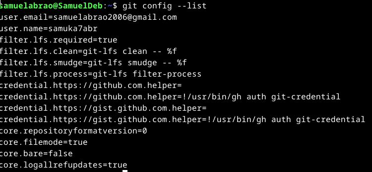

# 🧠 Monitoria de Estrutura de Dados – IDP

Bem-vindo(a) ao repositório oficial da **Monitoria de Estrutura de Dados**!  
Este repositório foi criado com o objetivo de reunir **materiais de apoio, exercícios práticos, códigos comentados e tutoriais** que vão te acompanhar ao longo da disciplina.

---

## 📚 Introdução à Matéria

A disciplina de **Estrutura de Dados** tem como objetivo desenvolver sua capacidade de resolver problemas com uso eficiente da memória e tempo de execução. Ao longo da matéria, você aprenderá a implementar e aplicar diversas estruturas fundamentais da computação, como:

- Ponteiros e alocação dinâmica de memória
- Recursividade
- Tipos abstratos de dados (TADs)
- Listas sequenciais e dinâmicas
- Pilhas e filas
- Árvores (binárias e de busca)
- Grafos
- Algoritmos de ordenação e busca

O arquivo completo com a ementa oficial da disciplina está disponível em:

📄 `Slides/Plano de Ensino - Estrutura de Dados.pdf`

---

## 📝 Exercícios

Durante a monitoria, serão propostos exercícios práticos que complementam os temas trabalhados em sala.  
Esses exercícios **valem até 0,5 ponto na média bimestral** e são corrigidos de acordo com a entrega via pull request no GitHub.

A nota será calculada da seguinte forma:

```
Nota = (0,5 / num_de_tarefas) / num_de_tarefas_feitas
```

Os exercícios estarão organizados nas pastas:

```
Exercícios/
├── A1/
└── A2/
```
As entregas serão feitas a partir de forks e pull-requests aqui no github mesmo. Aqui vai um tutorial:

---

## ⚙️ Passo a Passo para Instalar e Configurar o Git

### 1. Verificar se o Git já está instalado:

Abra o terminal e digite:

```bash
git --version
```

Se retornar algo como `git version 2.x.x`, está tudo certo.

### 2. Instalar o Git:

- **Windows:** [https://git-scm.com/download/win](https://git-scm.com/download/win)
- **macOS:** [https://git-scm.com/download/mac](https://git-scm.com/download/mac)
- **Linux:** `sudo apt install git` (Ubuntu/Debian)

### 3. Configurar o Git pela primeira vez:

Para verificar se seu git já está configurado, rode o comando: 

```bash
git config --list
```

Caso não esteja:

```bash
git config --global user.name "Seu Nome"
git config --global user.email "seu@email.com"
```




---

## 🧭 Como Clonar o Repositório e Abrir um Pull Request

### 1. Criar seu fork:
Ao acessar a página principal do repositório da monitoria, você verá (no canto superior direito) um botão escrito fork.


Ao clicar nesse botão, crie o repositório:


---

### 2. Clonar o repositório:

```bash
git clone <link do seu fork>
cd Monitoria-EDA (pode ser o nome do seu fork, mas sugiro não fazer alteração.)
```


---

### 3. Sincronizar com o repositório ANTES de fazer alterações:

Esse comando servirá para que seu fork
```bash
git pull origin main
```

### 4. Fazer alterações e subir para o GitHub:

```bash
git add .
git commit -m "resolvendo atividade X"
git push origin main
```

🖼️ *[espaço para captura de tela: terminal com push]*  
`assets/git-push.png`

---

### 5. Abrir o Pull Request

1. Vá ao repositório no GitHub
2. Clique em **"Pull Requests"** > **"New Pull Request"**
3. Descreva brevemente o que foi resolvido e envie

🖼️ *[espaço para captura de tela: botão Pull Request]*  
`assets/pull-request.png`

---

## 📂 Estruturas de Dados

A pasta `Estruturas/` contém **bases de código comentadas** das principais estruturas da disciplina, prontas para estudo, extensão e prática.

```
Estruturas/
├── lista_sequencial/
├── lista_dinamica_simples/
├── lista_dinamica_dupla/
├── pilhas/
├── filas/
├── arvores/
│   ├── binaria/
│   └── busca/
└── grafos/
```

Cada estrutura conta com arquivos `.c` e `.h`, com exemplos prontos para compilar e testar.

---

## 🧵 Canal da Monitoria (Discord)

A monitoria será transmitida ao vivo e o suporte será prestado pelo servidor oficial do Discord:

🔗 [https://discord.gg/JTwkRGUsWH](https://discord.gg/JTwkRGUsWH)

Lá você poderá:
- Tirar dúvidas em tempo real
- Enviar trechos de código
- Acompanhar as transmissões da monitoria
- Interagir com colegas da turma

---

Bons estudos e sucesso na disciplina!  
**Monitoria de Estrutura de Dados – IDP**